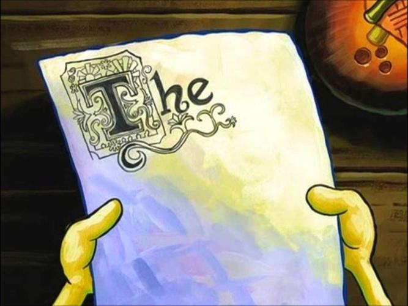

# So, this is a thing.
I'm starting a blog.

This is mostly intended to be an open journal. 
I don't really expect anyone to read this, but I'll be pleased if people do.
If you are reading this, please send me an email and say hi!

# Stuff That I Plan to Write About
I expect I'll ramble about whatever project/idea I happen to be working on at
the time and rant about whatever piece of software happens to be ruining my day.
I tend to work on a lot of stuff related to rockets, cubesats, and rapid
prototyping, since my hobby and/or professional development thing is the
[Portland State Aerospace Society](http://psas.pdx.edu/).
I also spend a lot of time tinkering in Linux. So, statements along the lines of
"Python and the web are *ruining today's youth!*" aren't out of the ordinary.

# What's with the name?
It's a low-effort pun on "This page intentionally left blank.".
I feel like it has a bit of metaphorical resonance with the *blank page problem*.
Bonus, if I never write anything or if I post extremely infrequently, the title
and content will be consistent with each other!

The blank page problem is a notion from the art world.
It's the angst you feel when you're sitting in front of a blank page (or an
empty text file, a schedule-less day, et cetera) and you don't know where to
start.
It's a notion that's near-and-dear to my heart.
I don't think it's particularly profound, but it was an important step in my
maturity.
Initially, I didn't like to make arbitrary choices.
Eventually, I accepted that *just picking a structure*, even if it wasn't a
perfectly ideologically/theoretically justified structure, would allow me to
spend more time creating and less time worrying.

*Spongebob struggling with the blank page problem*

I'm continually surprised by how this concept isn't accepted in technical
domains.
I learned it in the domain of musical composition and transferred it to
engineering.
I think technical people don't like to accept arbitrary structures becuase "What
is the optimal X?" *is a legitimate question* in technical domains.
It's possible to make architectural choices which are *objectively better* than
others, which isn't possible in art.

Completing the ourobouros, I have to acknowledge that it's possible to mess
things up in the other direction.
Again, this happens a lot in technical domains.
People will assign structure where none is needed.
You didn't follow my capitalization scheme in your variable names? Invalid!
You didn't use my object structure? Invalid!
You used more than one drawing view per page? Invalid!
Similarly, people can enforce needed structures for non-obvious reasons...
Speaking of which, the appearance of this blog is definitely going to change
over time as I gut the CC0'd Jekyll theme that I used as a starting point.

# The Competition
Apparently, I'm not [the first person to think this would be a cute name for a
blog](https://www.unintentionallyblank.co.uk/).
That blog hasn't had a post in over 11 years.
If I were going by US ham radio rules, he'd have another 6-ish months before it's
fair game for me to swoop him.
But, this is the internet, and I'm not.
Then again, it may take me that long to get around to actually hosting this.
